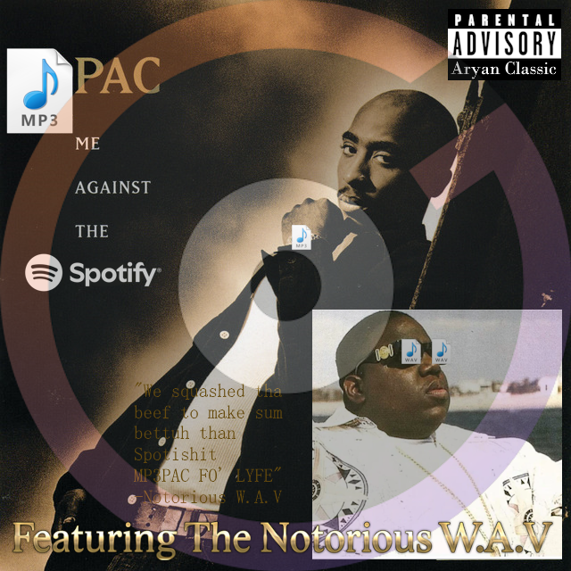

# MP3PacEditor - audio file metadata editor 4 boss playas

_biggie wuz tha meanin of lyfe..._

# Intro

This program was built for quickly and visually editing metadata (title, artist, album, etc.) of audio files like MP3s and more.
Designed for desktop usage, this is an easy-to-use local tool with zero bloat, no internet dependency, and full support for album art, renaming, saving copies, and more.
It might be useful for somebody who still downloads audio files in their daily life (like me). I made this program so I would have an easier time editing audio files which I will use on my PC and in my car.

Built using **Windows Forms (.NET)** and powered by **TagLib#** for reading/writing audio metadata.

# 1. Installation

### Windows
- Download the latest `MP3PacEditor.exe` release from: [https://github.com/FerBlazt/MP3PacEditor/releases](https://github.com/FerBlazt/MP3PacEditor/releases)
- Just run it. No setup needed.
- Optional: add album art placeholder in `Resources` if missing images bother you.

### Linux
- **MP3PacEditor** uses **WinForms** which is natively tied to **_Windows_**. You might be able to run it using tools like **Wine** or **Mono**, but I haven't tested.

> **Note:** MP3PacEditor is fully offline. No telemetry. No updates. Just clean metadata edits.

# 2. Usage

- Launch the program
- Use the **"Select Folder"** button to load all audio files in a directory
- Click on any file to see/edit:
  - 🎵 Title
  - 👤 Artist
  - 💿 Album
  - 🕒 Duration
  - 📅 Created / Modified dates
  - 📁 File size / Bitrate
  - 🎨 Album art (auto-extracted or manually added)
- Use:
  - **"Save"** to update metadata
  - **"Save Copy"** to apply metadata changes to a duplicate of the file
  - **"Clear All Metadata"** to erase all metadata from selected file (not yet implemented)
  - **"Delete File"** to remove the selected file
  - **"Match File Name"** to rename files to a `Artist - Title & Album` pattern
- Album art is displayed in a square viewer. Click it to open full-size viewer.
- Search bar lets you live-filter by file name.
- Sorting available by clicking on column headers.

# 3. Supported formats

All formats supported by TagLib# are supported by MP3PacEditor:

✅ `.mp3`, `.flac`, `.ogg`, `.wav`, `.aiff`, `.wma`, `.m4a`, `.mp4`, `.aac`, `.alac`, `.ape`, `.mpc`, `.wv`

# 4. Features

- [x] Album art viewer (auto-cropped square thumbnail + full-res viewer)
- [x] Full sorting & filtering
- [x] Manual and automatic file renaming (`Artist - Title & Album`)
- [x] Clone file with new metadata using `Save Copy`
- [x] Custom warning popups (non-blocking)
- [x] Persistent last-used folder (config file)
- [x] Custom UI styling
- [x] Placeholder image for missing album art
- [x] Extension-preserving rename protection
- [x] Custom exceptions with error logging
- [x] Popup timer visual and fadeout

# 4. Upcoming features

- [ ] Option to edit album art (add/replace/remove)
- [ ] Option to mass rename all files automatically (applying the `Artist - Title & Album` renaming to all detected folder files, with exception handling and failed file renaming error logging)
- [ ] Dark theme
- [ ] Option to view ALL metadata of a file, not just select sections
- [ ] General selectable options

# 6. Building

### Requirements

- .NET Framework 4.8 or newer
- TagLib# (included as reference)

### Building

- Open the solution in Visual Studio
- Build the solution
- Run `MP3PacEditor.exe`

# 7. Credits

- Onniro for giving me the motivation to make MP3PacEditor by making his [2PACMPEG](https://github.com/onniro/2PACMPEG)
- Icon designed by my playa Karkagami
- TagLib# - metadata backend
- .NET WinForms - GUI platform
